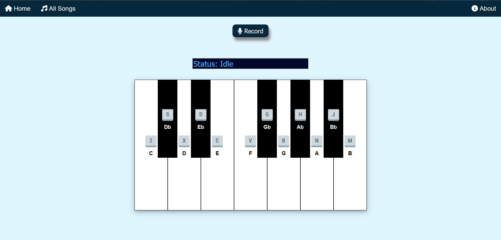

# Harmony
A website that lets you create your own music on a simple, virtual keyboard.

You can play around with the virtual keyboard and save your music to listen later!

# How to use

* You can use the keyboard or click on the keys displayed on the screen to play the particular note.

* Click on the Record button to record your music and click on it again to stop recording and listen to a preview. You can also listen to it using the Play button.

* If you wish to save the music, click on the save button, enter a title for your music and click on the Save button in the pop-up. This will store the music in our database and make it available in 'All Songs'

# Video Demo
The audio doesn't sound great here but it sounds better in the live demo. So, make sure to check that if you have time!

# How to run
If you wish to run it in your local machine, make sure to have [MongoDB](https://www.mongodb.com/) installed first. This is required if you want to use the 'Record' feature.

Once the database is set up, follow these steps:

1. Clone this repository.
2. Run the command `npm install` to install the dependencies.
3. Run the server with `npm start`
4. Your application should be running at http://localhost:5000